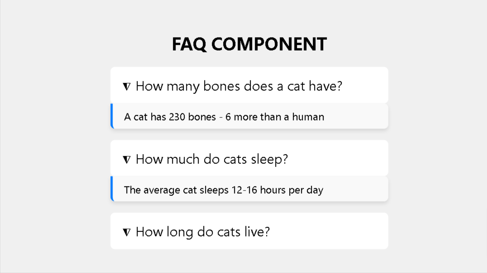
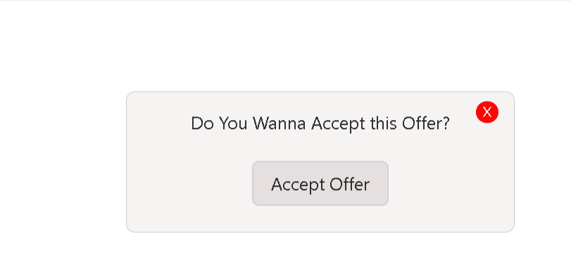

# JavaScript-React-Practices

## This repository contains my mini-projects/components in JavaScript and ReactJS that I've built while learning frontend development and APIs. Replace 'X' with the folder name to view the live demo. If there is a space in the folder name, replace it with '%20'. For example, 'Colour%20Changer'—add this replacing 'X' to view the live demo (only works if the project is in Vanilla JS).

## LINK - [https://aniketsinha2002.github.io/Javascript-and-API-practices/X](https://aniketsinha2002.github.io/Javascript-and-API-practices/X)

Replace the 'X' in the link following the instructions mentioned above (works only for projects in Vanilla JS).

List of few Ones (recent)-
### QUESTION 1 - https://frontendeval.com/questions/faq-component

### QUESTION 2 - https://frontendeval.com/questions/modal-overlay
